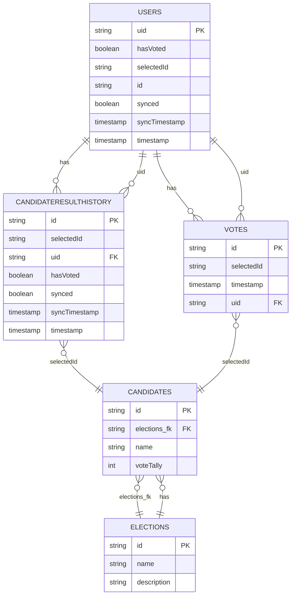

# Firebase ER Diagram

```mermaid
erDiagram
    USERS {
        string uid PK
        boolean hasVoted
        string selectedId
        string id
        boolean synced
        timestamp syncTimestamp
        timestamp timestamp
    }
    CANDIDATERESULTHISTORY {
        string id PK
        string selectedId
        string uid FK
        boolean hasVoted
        boolean synced
        timestamp syncTimestamp
        timestamp timestamp
    }
    VOTES {
        string id PK
        string selectedId
        timestamp timestamp
        string uid FK
    }
    CANDIDATES {
        string id PK
        string elections_fk FK
        string name
        int voteTally
    }
    ELECTIONS {
        string id PK
        string name
        string description
    }

    USERS ||--o{ CANDIDATERESULTHISTORY : has
    USERS ||--o{ VOTES : has
    ELECTIONS ||--o{ CANDIDATES : has
    CANDIDATES }o--|| ELECTIONS : elections_fk
    CANDIDATERESULTHISTORY }o--|| USERS : uid
    CANDIDATERESULTHISTORY }o--|| CANDIDATES : selectedId
    VOTES }o--|| USERS : uid
    VOTES }o--|| CANDIDATES : selectedId
```

> Save this file as a reference for your Firebase schema. You can view and edit the diagram using the [Mermaid Live Editor](https://mermaid.live/).
