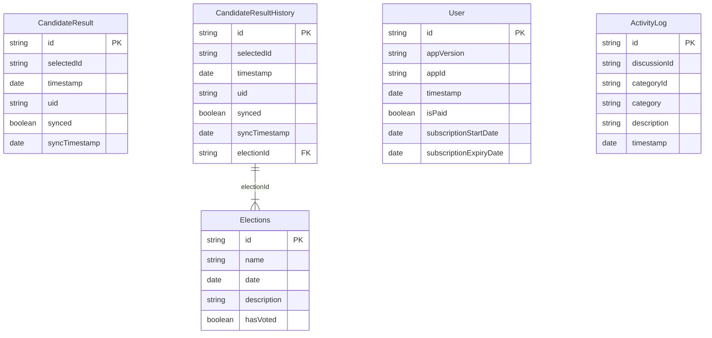

# Realm ER Diagram

```mermaid
erDiagram
    Elections {
        string id PK
        string name
        date date
        string description
        boolean hasVoted
    }
    CandidateResult {
        string id PK
        string selectedId
        date timestamp
        string uid
        boolean synced
        date syncTimestamp
    }
    CandidateResultHistory {
        string id PK
        string selectedId
        date timestamp
        string uid
        boolean synced
        date syncTimestamp
        string electionId FK
    }
    User {
        string id PK
        string appVersion
        string appId
        date timestamp
        boolean isPaid
        date subscriptionStartDate
        date subscriptionExpiryDate
    }
    ActivityLog {
        string id PK
        string discussionId
        string categoryId
        string category
        string description
        date timestamp
    }

    CandidateResultHistory ||--|{ Elections : electionId
```

> This file documents the Realm schema for historical reference.
